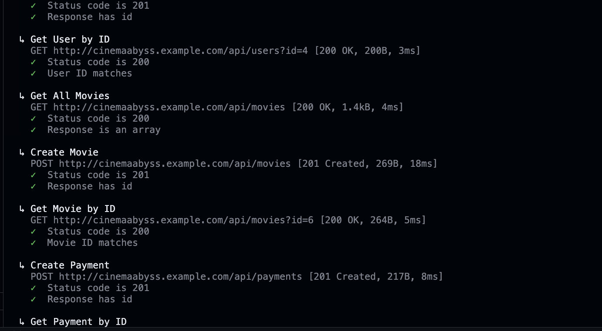
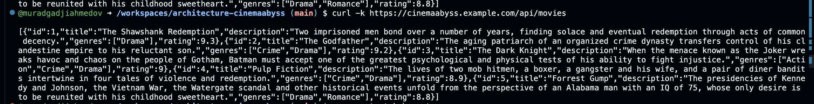

## Изучите [README.md](.\README.md) файл и структуру проекта.

# Задание 1

1. [/workspaces/architecture-cinemaabyss/c4.puml](C4 диаграмма)

# Задание 2

### 1. Proxy

Сделано

### 2. Kafka
 
 

 

# Задание 3

Команда начала переезд в Kubernetes для лучшего масштабирования и повышения надежности. 
Вам, как архитектору осталось самое сложное:
 - реализовать CI/CD для сборки прокси сервиса
 - реализовать необходимые конфигурационные файлы для переключения трафика.

### CI/CD

Сдеално https://github.com/muradgadjiahmedov/architecture-cinemaabyss/actions/runs/16551799230

### Proxy в Kubernetes

#### Шаг 3
Добавьте сюда скриншота вывода при вызове https://cinemaabyss.example.com/api/movies и  скриншот вывода event-service после вызова тестов.

# Задание 4

